```{r, include = FALSE}
knitr::opts_chunk$set(
  collapse = TRUE,
  comment = "#>"
)
```


```{r eval = FALSE}
library(ITSMe)

```

## Goal

The goal of the ITSMe (Individual Tree Structural Metrics) R package is to 
provide easy to use functions to quickly obtain structural metrics from 
individual tree point clouds and their respective 
[TreeQSMs](https://github.com/InverseTampere/TreeQSM). 

## Point cloud based metrics

### Overview

An overview of the basic structural metrics which can be measured from an 
individual tree point cloud with the ITSMe package: 

| structural metric             | function name                     | 
| ------------------------------|:---------------------------------:|
| diameter at breast height (m) | `dbh_pc`                          |
| diameter above buttresses (m) | `dab_pc`                          | 
| tree height (m)               | `tree_height_pc`                  | 
| projected area (m$^{2}$)      | `projected_area_pc`               | 
| alpha volume (m$^{3}$)        | `alpha_volume_pc`                 | 

### Tree point cloud requirements

The tree point cloud based functions were developed for point clouds acquired 
with TLS. But they can also be used for tree point clouds obtained from other 
LiDAR platforms (e.g. MLS, UAV-LS). Keep in mind that the accuracy of the metric 
measurements will depend on the quality of the data. 

Make sure outliers and points that don't belong to the tree (especially near the 
trunk) are removed. Good segmentation quality leads to reliable measurements.
Down sampling of the point cloud is not required but can reduce computation time 
for very big tree point clouds (down sampling to 2 cm is suggested).

### Workflow for a single tree

Before running the functions on multiple tree point clouds at a time, it is 
advised to get familiar with the functions and their input parameters by running 
the functions on a single tree point cloud. 

#### Read the point cloud

All of the point cloud based functions (mentioned above) need a tree point cloud 
in the form of a data.frame with columns X, Y, Z as their first argument. The 
ITSMe package provides a function `read_tree_pc` that takes the path to a tree 
point cloud file (txt, ply or las) as an argument and returns a data.frame with 
X, Y, Z columns.

```{r eval = FALSE}
# Read the point cloud file from its' specified path
tree_pc <- read_tree_pc(path = "path/to/point/cloud.txt")
```

#### Measure position of tree point cloud

The position of the tree can be easily determined using `tree_position_pc`, 
which determines the mean X, Y and Z value of the 100 lowest points of the tree 
point cloud. Using the 100 lowest points makes it possible to use this function 
also for UAV-LS tree point clouds that do not sample the stem very well.
```{r eval = FALSE}
# Measure tree position from the tree point cloud
XYZ_pos <- tree_position_pc(pc = tree_pc)
```

#### Measure tree height

The tree height can be measured using `tree_height_pc`, which calculates the 
difference between the Z-value of the highest and lowest point of the tree point 
cloud. `tree_height_pc` only requires the tree point cloud as an input. It also 
optionally plots the tree point cloud in 2D (XZ and YZ plots next to each) when 
the "plot" parameter equals TRUE. 
```{r eval = FALSE}
# Measure tree height from the tree point cloud
H <- tree_height_pc(pc = tree_pc)
# also plot the tree point cloud
H_out <- tree_height_pc(pc = tree_pc, plot = TRUE)
H <- H_out$h
plot_tree <- H_out$plotTree
```
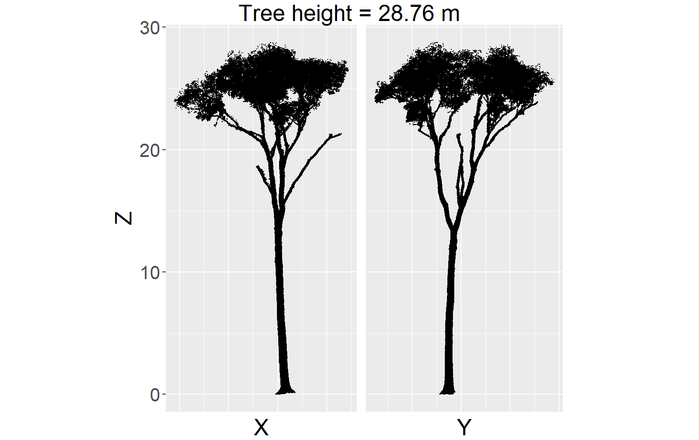

However, for tree point clouds that are obtained with for example UAV-LS and 
that do not sample the base of the tree sufficiently the tree height would be 
underestimated. In this case a digital terrain model (DTM) with a certain 
resolution can be provided to the `tree_height_pc` function to improve tree 
height estimation. The DTM also needs to be supplied in the data.frame format 
with columns X, Y, and Z.

```{r eval = FALSE}
# Read the DTM
DTM <- read_tree_pc(path = "path/to/dtm.txt")
# Measure tree height from the tree point cloud and DTM with resolution r
H <- tree_height_pc(pc = tree_pc, dtm = DTM, r = 1.5)
# also plot the tree point cloud and estimated lowest point based on DTM
H_out <- tree_height_pc(pc = tree_pc, dtm = DTM, r = 1.5, plot = TRUE)
H <- H_out$h
plot_tree <- H_out$plot
```
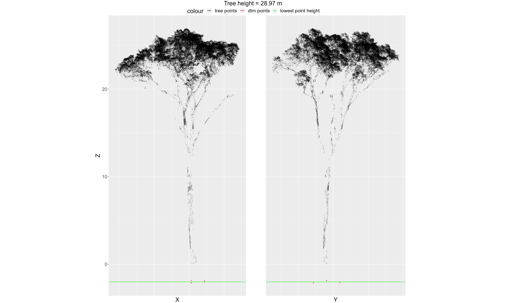
The provided resolution (r) value should be at least the resolution of the
provided DTM.

#### Measure DBH and/or DAB

Depending on if your trees are buttressed or not, you will make a choice between 
the diameter at breast height (DBH) and the diameter above buttresses (DAB). If 
you are not sure if this is the case for your tree, you can check the slice 
(and circle fitting) at 1.3 m with the `diameter_slice_pc` function. The 
diameter is measured as the circle fit to the slice points. But this function 
also determines the functional diameter which is calculated as the diameter of 
the circle with the same area as the concave hull (concavity = 4) fitted to the 
slice points. This value could be more interesting for trees that inherently 
have non-circular stems. But this metric is influenced more by point cloud and 
segmentation quality (e.g. noisy points, or vegetation points which have not 
been removed from the point cloud).

```{r eval = FALSE}
# Measure DBH from the tree point cloud and plot the circle fitting
D_out <- diameter_slice_pc(
  pc = tree_pc, slice_height = 1.3,
  slice_thickness = 0.06, plot = TRUE
)
diameter <- D_out$diameter
functional_diameter <- D_out$fdiameter
```

For a regular non-buttressed tree:
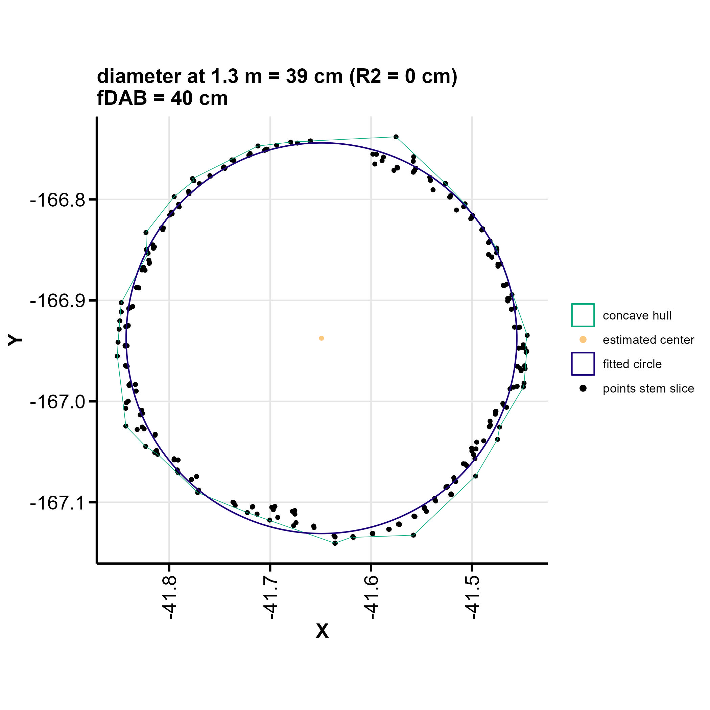
For a buttressed tree:
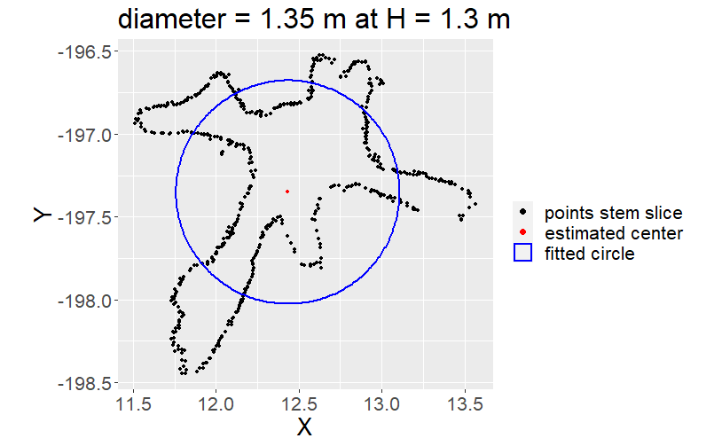

The DBH is measured using `dbh_pc` and based on the `diameter_slice_pc` function 
with *slice_height* of 1.3 m and a chosen *slice_thickness* (default = 0.06 m). 
If branch or vegetation points are present in the slice, the lower (till 1.5 m 
above lowest point) trunk is extracted (so without branch/vegetation points) and 
the fit is done again. The `dbh_pc` function needs the tree point cloud as an 
input. If the argument *plot* is set TRUE it also plots the circle fitting. This 
function also reports the functional DBH (fDBH).

```{r eval = FALSE}
# Measure DBH from the tree point cloud and plot the circle fitting
DBH_out <- dbh_pc(pc = tree_pc, plot = TRUE)
DBH <- DBH_out$dbh
```
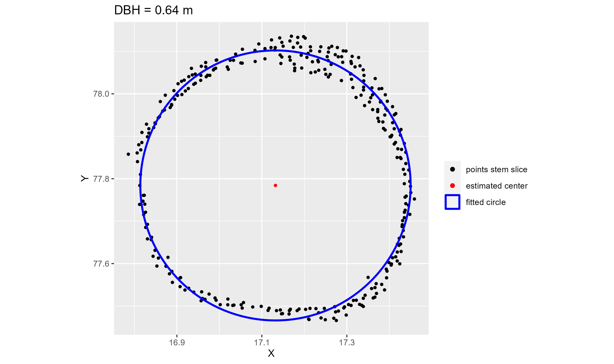

Generally running the `dbh_pc` with default values is fine. But there are two 
other parameters that can be optimised which influence the trunk extraction. The 
*thresholdR2* parameter (default = 0.001) determines when the trunk extraction 
is done. The trunk is extracted when the initial diameter estimation at breast 
height results in NaN, a value higher than 2 m, the residuals are higher than 
the thresholdR2 times the estimated diameter or the estimated diameter is 
smaller than the diameter estimated at 0.15 m. For trees with non-circular stems
this value should be increased. Also for smaller trees (DBH < 10 cm) or tree 
point cloud with a sub-optimal co-registration of scan positions, for example 
due to wind) a higher value will lead to better results. The *slice_thickness* 
parameter determines the thickness of the slice at 1.3 m and is default 0.06 m. 
For tree point clouds with a lower point density at the stem (e.g. UAV-LS) 
increasing the slice_thickness to for example 20 cm is crucial for DBH 
measurements.

For buttressed trees `dbh_pc` would result in:

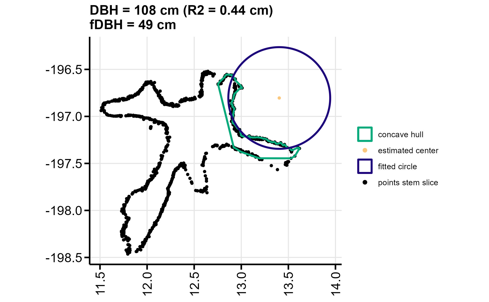


In this case determining the DAB with `dab_pc` is the better option. Also for 
trees with DBH larger than 2 m and no branches at or below breast height this 
function is recommended (even if buttresses are not present). With `dab_pc`, the 
diameter (from the optimal circle fitted through a 6mm thick horizontal slice) 
is measured above the buttresses (if there are no buttresses the diameter is 
measured at breast height). The height at which the horizontal slice is taken 
(the height above buttresses), is determined iteratively, starting at breast 
height. The average residual between the points and the fitted circle is 
calculated. When the average residual exceeds a value of *thresholdbuttress* 
times the radius, indicating a non-circular (irregular) stem shape and 
presumably buttresses, and the *maxbuttressheight* is not exceeded, the process 
is repeated with a new slice 6 mm higher than the previous one. When the 
*maxbuttressheight* is exceeded the iterative process is restarted with a 
*thresholdbuttress* increased with 0.0005. Also in this case a functional 
DAB (fDAB) is reported.

```{r eval = FALSE}
# Measure DAB from the tree point cloud with default settings and plot the circle fitting
DAB_out <- dab_pc(pc = tree_pc, plot = TRUE)
DAB <- DAB_out$dab
```
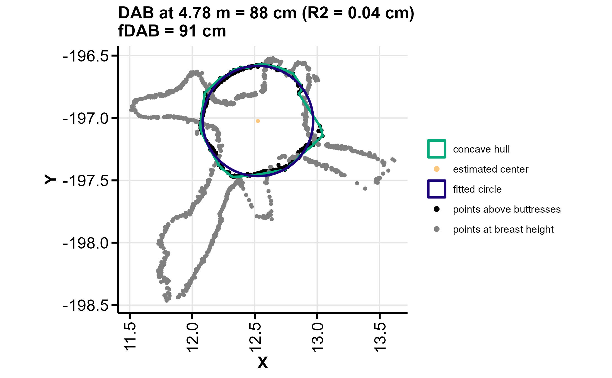

Optimise the values of *thresholdbuttress* and or *maxbuttressheight* for your 
tree if default values do not lead to the desired results:

 * reduce/increase *thresholdbuttress* if the height above buttresses is 
 consistenly too low/high.
 * reduce/increase *maxbuttressheight* if your buttresses reach lower/higher 
 heights.

The `dbh_pc` and `dab_pc` do not yet work well on very slanted trees. 
Therefore it is advised to always check the plots of the circle fitting. 

For tree point clouds of which the stem of the tree is not sufficiently sampled 
`dbh_pc` and `dab_pc` will not work due to a lack of stem points. 

#### Classify crown points 

As a basis for crown metrics (e.g. projected crown area and 3D alpha crown 
volume) the `classify_crown_pc` is used to return the points from the tree 
point cloud that belong to the crown. The crown is defined here as all points of 
the tree except for the stem points below the first branch. The height where the 
first branch emerges is iteratively determined (starting from *minheight*) as 
the height where the diameter of the stem exceeds *thresholdbranch* multiplied 
with the DBH or DAB. 

```{r eval = FALSE}
# Classify the tree point cloud with default settings and plot the classification results
C_out <- classify_crown_pc(pc = tree_pc, plot = TRUE)
crown_pc <- C_out$crownpoints
plot <- C_out$plot
```

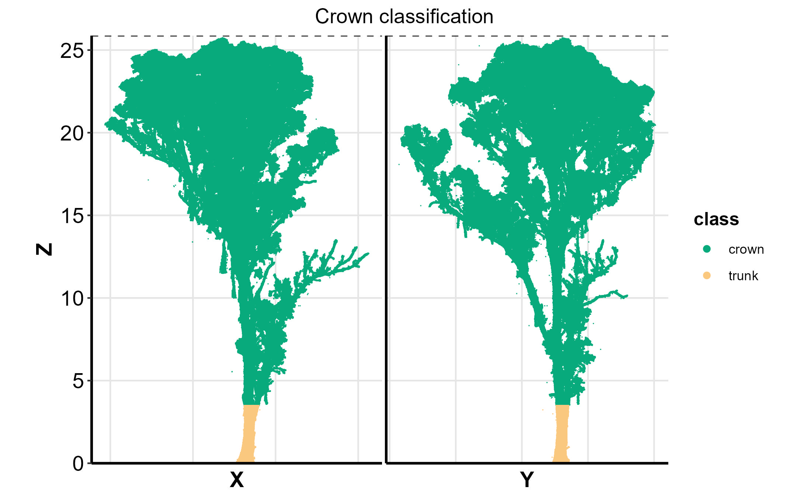

Optimise the values of *thresholdbranch* and or *minheight* for your 
tree if default values do not lead to the desired results:

 * reduce/increase *thresholdbranch* if the crown height is consistently 
 determined too high/low.
 * reduce *minheight* if the height at which the crown starts is 
 typically lower. 
 * increase *minheight* to the height above the widest part of the lower stem 
 (for example above the buttresses).

For non-buttressed trees, specify the previosuly determined *thresholdR2* and 
*slice_thickness* parameters. For buttressed trees, the attribute *buttress* has 
to be set TRUE and previously chosen attributes *thresholdbuttress* and 
*maxbuttressheight* can be specified. It is recommended to increase the 
*minheight* for buttressed trees.

```{r eval = FALSE}
# Classify the tree point cloud of a buttressed tree and plot the classification results
C_out <- classify_crown_pc(
  pc = tree_pc, minheight = 4, buttress = TRUE,
  plot = TRUE
)
crown_pc <- C_out$crownpoints
plot <- C_out$plot
```
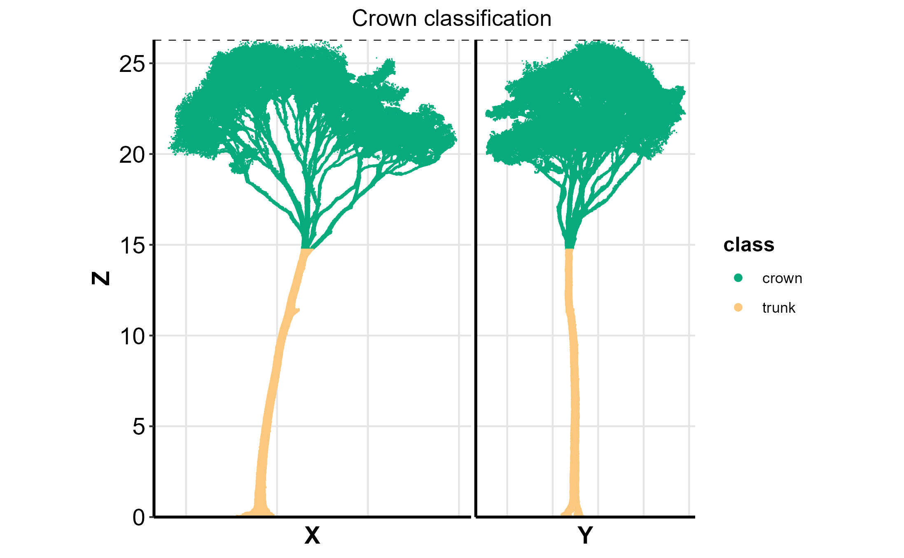

#### Measure the projected area

The projected (crown) area of a tree point cloud can be measured with 
`projected_area_pc` which calculates the area of a concave hull (based on [concaveman](https://cran.r-project.org/web/packages/concaveman/index.html)) 
fitted to the input point cloud. The *concavity* (default=2) can be chosen and a 
plot is made when parameter *plot* equals TRUE. If the input point cloud is the 
full tree point cloud the output is the projected tree area. If the input is the 
crown point cloud (determined with `classify_crown_pc` or in your own way) the 
output is the projected crown area.
```{r eval = FALSE}
# Measure the projected crown area and plot the results
out <- projected_area_pc(pc = crown_pc, plot = TRUE)
pca <- out$pa
plot <- out$plot
```
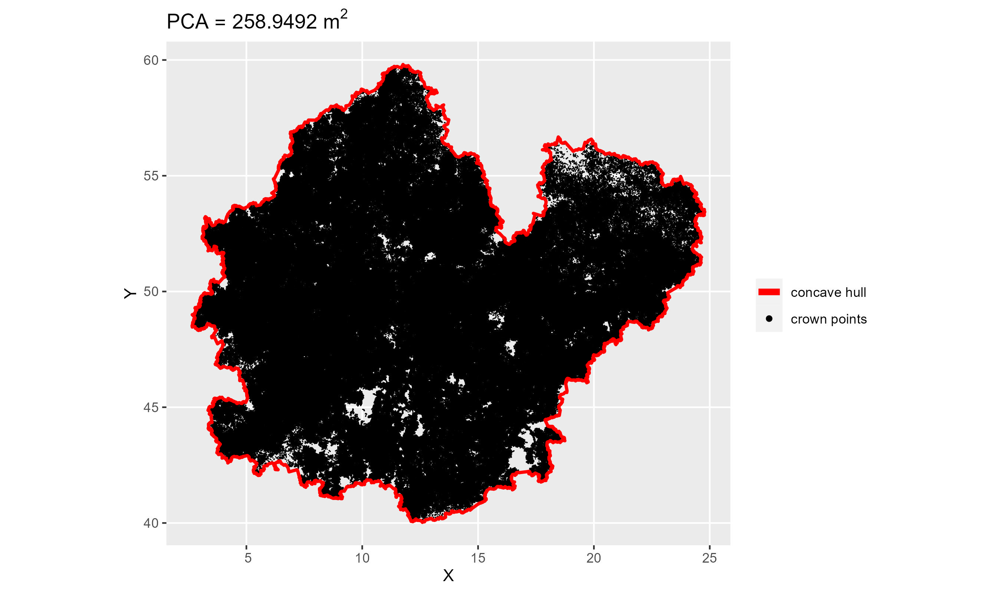

#### Measure the 3D alpha volume

The 3D alpha (crown) volume of tree point cloud can be measured with 
`alpha_volume_pc` which calculates the volume of the 3D alpha-shape (based on [alphashape3d](https://cran.r-project.org/web/packages/alphashape3d/index.html)) 
fitted to the (crown) points. The *alpha* (default=1) can be chosen and a 3D
plot is made when parameter *plot* equals TRUE. 
```{r eval = FALSE}
# Measure the crown volume and generate 3D plot
out <- alpha_volume_pc(pc = crown_pc, plot = TRUE)
volume <- out$av
```
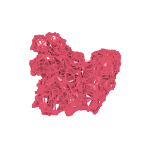

### Workflow for multiple trees

#### Optimise and plot

Often you want to check or optimise the performance of the (default) attributes 
used in tree height, DBH, DAB, crown classification, projected area, and 3D 
alpha volume calculation, for multiple tree point clouds in one folder. For this 
purpose you can use `plot_tree_height_pcs` (based on `tree_height_pc`), 
`plot_circle_fit_pcs` (based on `diameter_slice_pc`), `plot_dbh_fit_pcs` 
(based on `dbh_pc`), `plot_dab_fit_pcs` (based on `dab_pc`), 
`plot_crown_classification_pcs` (based on `classify_crown_pc`), `plot_pa_pcs` 
(based on `projected_area_pc`), `plot_av_pcs` (based on `alpha_volume_pc`) 
which return the tree height, diameter, DBH, DAB, PCA and CV for each tree in a 
folder (*PCs_path*) and save the respective figures in the given output path  
(*OUT_path*). First run these functions with default parameters and check 
the rendered figures. Optionally change the attributes of the functions: 

  1. `plot_tree_height_pcs`: *r* (when DTM is provided)
  2. `plot_dbh_fit_pcs`: *thresholdR2*, *slice_thickness*
  3. `plot_dab_fit_pcs`: *thresholdbuttress*, *maxbuttressheight*
  4. `classify_crown_pc`: *thresholdbranch*, *minheight* 
  5. `plot_pca_pcs` & `volume_crown_pc`: *concavity* & *alpha*

```{r eval = FALSE}
# Tree height:
# Plot the tree point clouds (check for outliers)
# Specify dtm and r in case lower part of tree is not sampled
Hs <- plot_tree_height_pcs(
  PCs_path = "path/to/point/clouds/folder/",
  extension = ".ply",
  OUT_path = "path/to/output/folder/",
  dtm = DTM, r = 2
)

# DBH:
# try out different thresholdR2 and slice_thickness values when default values fail
DBHs <- plot_dbh_fit_pcs(
  PCs_path = "path/to/point/clouds/folder/",
  extension = ".ply",
  OUT_path = "path/to/output/folder/",
  thresholdR2 = 0.0025, slice_thickness = 0.2
)
# DAB:
# try out different values for thresholdbuttress and maxbuttressheight when default values fail
DABs <- plot_dab_fit_pcs(
  PCs_path = "path/to/point/clouds/folder/",
  extension = ".las",
  OUT_path = "path/to/output/folder/",
  thresholdbuttress = 0.002, maxbuttressheight = 9
)
# Crown classification:
# For non-buttressed trees: (buttress = FALSE,) specify thresholdR2 and slice_thickness chosen in previous step
# For buttressed trees: buttress = TRUE, specify thresholdbuttress and maxbuttressheight chosen in previous step
# Try out different values for thresholdbranch and minheight
crown_pcs <- plot_crown_classification_pcs(
  PCs_path = "path/to/point/clouds/folder/",
  extension = ".txt",
  OUT_path = "path/to/output/folder/",
  thresholdbranch = 2, minheight = 3, buttress = TRUE,
  thresholdbuttress = 0.002, maxbuttressheight = 9
)
# Projected area
# Try out a different value for concavity
# indicate crown = TRUE if you want to calculate projected area on the crown points only
# In this case: also specify the values for the crown classification chosen in previous step
PAs <- plot_pa_pcs(
  PCs_path = "path/to/point/clouds/folder/",
  extension = ".ply",
  OUT_path = "path/to/output/folder/", concavity = 3,
  thresholdbranch = 2, minheight = 3, buttress = TRUE,
  thresholdbuttress = 0.002, maxbuttressheight = 9
)
# 3D alpha volume
# Try out a different value for alpha
# indicate crown = TRUE if you want to calculate projected area on the crown points only
# In this case: also specify the values for the crown classification chosen in previous step
AVs <- plot_av_pcs(
  PCs_path = "path/to/point/clouds/folder/",
  extension = ".las",
  OUT_path = "path/to/output/folder/", alpha = 2,
  thresholdbranch = 2, minheight = 3, buttress = TRUE,
  thresholdbuttress = 0.002, maxbuttressheight = 9
)
```

#### Summarise

Once you have decided on default/optimised attributes, you can summarise all 
point cloud structural metrics in one data.frame (and optionally export it to a 
csv file) for all tree point clouds in a folder with 
`summary_basic_pointcloud_metrics`. If the *plot* parameter is TRUE, a summary 
figure is rendered for each tree in the folder.

If you find different optimal attribute values for different trees, split the 
trees up in groups with the same parameter values (e.g. buttressed and 
non-buttressed, small and big trees, species1 and species2). Put the groups in 
different folders and run the summary function on the different folders 
separately. Afterwards the outputs can be combined.

```{r eval = FALSE}
# Summary with default setting for non-buttressed trees and plot the summary
summary <- summary_basic_pointcloud_metrics(PCs_path = "path/to/point/clouds/folder_non-buttressed_trees/")
# Summary with default setting (except minheight and buttress) for buttressed trees
summary <- summary_basic_pointcloud_metrics(
  PCs_path = "path/to/point/clouds/folder_buttressed_trees/",
  minheight = 4, buttress = TRUE
)
```

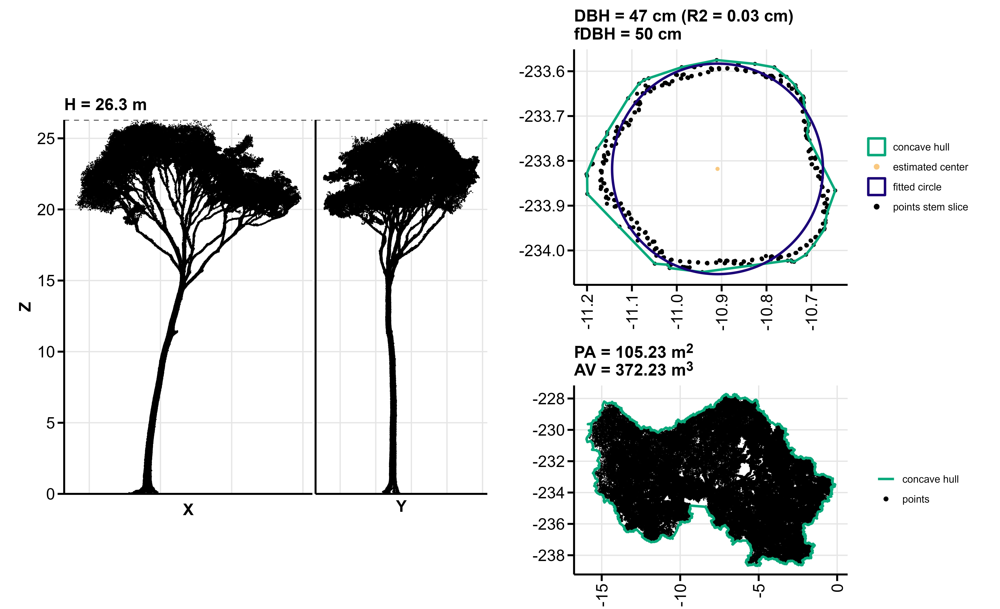

## QSM based metrics

### Overview

At the moment the ITSMe package contains 
[TreeQSM](https://github.com/InverseTampere/TreeQSM) based structural metrics 
defined by [Åkerblom et al. (2017)](https://doi.org/10.1016/j.rse.2016.12.002) 
and [Terryn et al. (2020)](https://doi.org/10.1016/j.isprsjprs.2020.08.009).

#### Structural metrics from Terryn et al. (2020)

These are the metrics defined in Terryn et al. (2020) which were copied and 
adapted from Åkerblom et al. (2017) except for the branch angle ratio and the 
relative volume ratio which were new metrics. Definitions of the metrics can be 
found in the help files of the functions and the papers of Terryn et al. (2020) 
and Åkerblom et al. (2017). Normalisation according to Terryn et al. (2020) as 
well as Åkerblom et al. (2017) is possible through the normalisation parameter 
included in the functions of the metrics that were adapted by Terryn et al. 
(2020). If the tree point cloud is provided along with the TreeQSM in the 
functions, DBH or DAB and tree height values are based on the point clouds 
rather than the QSMs. When the *buttress* parameter is indicated "TRUE" the DAB 
instead of the DBH is used.


| structural metric                         | function name                     | input                  |
| ------------------------------------------|:---------------------------------:|-----------------------:|
| stem branch angle (degrees)               | stem_branch_angle_qsm             | TreeQSM                |
| stem branch cluster size                  | stem_branch_cluster_size_qsm      | TreeQSM                |
| stem branch radius (-/m)                  | stem_branch_radius_qsm            | TreeQSM (+point cloud) |
| stem branch length (-/m)                  | stem_branch_length_qsm            | TreeQSM (+point cloud) |
| stem branch distance (-/m)                | stem_branch_distance_qsm          | TreeQSM (+point cloud) |
| dbh tree height ratio                     | dbh_height_ratio_qsm              | TreeQSM (+point cloud) |
| dbh tree volume ratio (m$^{-2}$)          | dbh_volume_ratio_qsm              | TreeQSM (+point cloud) |
| volume below 55                           | volume_below_55_qsm               | TreeQSM                |
| cylinder length volume ratio (m$^{-2}$)   | cylinder_length_volume_ratio_qsm  | TreeQSM                |
| shedding ratio                            | shedding_ratio_qsm                | TreeQSM                |
| branch angle ratio                        | branch_angle_ratio_qsm            | TreeQSM                |
| relative volume ratio                     | relative_volume_ratio_qsm         | TreeQSM                |
| crown start height                        | crown_start_height_qsm            | TreeQSM (+point cloud) |
| crown height                              | crown_height_qsm                  | TreeQSM (+point cloud) |
| crown evenness                            | crown_evenness_qsm                | TreeQSM                |
| crown diameter crown height ratio         | crown_diameterheight_ratio_qsm    | TreeQSM (+point cloud) |
| dbh minimum tree radius ratio             | dbh_minradius_ratio_qsm           | TreeQSM (+point cloud) |

### Workflow for a single tree

#### Read the TreeQSM

All of the TreeQSM based functions (mentioned above) need one or multiple 
components (e.g. cylinder, branch, treedata) of a TreeQSM in the form of lists 
as their fist arguments. The ITSMe package provides a function `read_tree_qsm` 
which reads a TreeQSM matlab file (.mat) and returns its' components in a list 
(and optionally saves the TreeQSM components into the global environment when 
*global* = TRUE). It requires the *path* to the TreeQSM .mat file as a first 
argument and the TreeQSM *version* as a second (default = "2.4.0") argument.

```{r eval = FALSE}
# Read the TreeQSM file from its' specified path
qsm <- read_tree_qsm(path = "path/to/treeqsm.mat")
# Read the TreeQSM file of version "2.3.0" from its' specified path into the global environment
qsm <- read_tree_qsm(
  path = "path/to/treeqsm.mat", version = "2.3.0",
  global = TRUE
)
```
#### Extract metrics Terryn et al. (2020)

After reading in the TreeQSM, the 17 different structural metrics listed in the 
table above can easily be calculated. Some of these structural metrics rely on 
only one of the TreeQSM components.

```{r eval = FALSE}
# Calculate the stem branch angle and branch angle ratio from the branch component
sba <- stem_branch_angle_qsm(branch = qsm$branch)
bar <- branch_angle_ratio_qsm(branch = qsm$branch)
# Calculate stem branch cluster size and crown evenness from the cylinder component
sbcs <- stem_branch_cluster_size_qsm(cylinder = qsm$cylinder)
ce <- crown_evenness_qsm(cylinder = qsm$cylinder)
# Calculate the cylinder length volume ratio from the treedata component
clvr <- cylinder_length_volume_ratio_qsm(treedata = qsm$treedata)
```
Other metrics rely on two of the TreeQSM components.

```{r eval = FALSE}
# Calculate the volume below 55 and the relative volume ratio from
# the cylinder and treedata component
vol_55 <- volume_below_55_qsm(cylinder = qsm$cylinder, treedata = qsm$treedata)
relvol_ratio <- relative_volume_ratio_qsm(
  cylinder = qsm$cylinder,
  treedata = qsm$treedata
)
# Calculate the shedding ratio from the branch and treedata component
shed_ratio <- shedding_ratio_qsm(branch = qsm$branch, treedata = qsm$treedata)
```

For some of the metrics which involve the DBH/DAB and/or the tree height, the 
tree point cloud of the tree can be provided as an input besides the TreeQSM 
data. This is because (in general) the DBH/DAB and tree height are more 
accurately measured from the complete tree point cloud. When the DBH is involved 
the DAB will be used if *buttress* = TRUE. Also specify the attribute values 
determined for the DBH or DAB measurement from a tree point cloud (see previous 
sections),

```{r eval = FALSE}
# Read the tree point cloud
tree_pc <- read_tree_pc(path = "path/to/point/cloud.txt")
# Calculate the dbh min tree radius and volume ratio using additional point cloud data
dmrr <- dbh_minradius_ratio_qsm(
  treedata = qsm$treedata,
  cylinder = qsm$cylinder, pc = tree_pc,
  thresholdR2 = 0.0025
)
dvr <- dbh_volume_ratio_qsm(
  treedata = qsm$treedata, pc = tree_pc,
  slice_thickness = 0.1
)
# Calculate the dbh height ratio of a buttressed tree using additional point cloud data
# Specify the optimised thresholdbuttress and maxbuttressheight when needed
dhr <- dbh_height_ratio_qsm(
  treedata = qsm$treedata, pc = tree_pc,
  buttress = TRUE, thresholdbuttress = 0.002,
  maxbuttressheight = 5
)
# Calculate the crown start height, crown height and crown diameter height ratio
# using additional point cloud data
csh <- crown_start_height_qsm(
  treedata = qsm$treedata, cylinder = qsm$cylinder,
  pc = tree_pc
)
ch <- crown_height_qsm(
  treedata = qsm$treedata, cylinder = qsm$cylinder,
  pc = tree_pc
)
cdhr <- crown_diameterheight_ratio_qsm(
  treedata = qsm$treedata,
  cylinder = qsm$cylinder,
  pc = tree_pc
)
```

Normalisation according to Terryn et al. (2020) as well as 
Åkerblom et al. (2017) is possible through the normalisation parameter 
included in the functions of the metrics that were adapted by Terryn et al. 
(2020).

```{r eval = FALSE}
# Calculate the stem branch radius according to Åkerblom et al. (2017)
sbr <- stem_branch_radius_qsm(
  cylinder = qsm$cylinder, treedata = qsm$treedata,
  normalisation = "parentcylinder"
)
# Calculate the stem branch length according to Terryn et al. (2020)
sbl <- stem_branch_length_qsm(
  branch = qsm$branch, treedata = qsm$treedata,
  normalisation = "treeheight"
)
# Calculate the stem branch distance according to Åkerblom et al. (2017) and
# using point cloud information
sbd <- stem_branch_distance_qsm(
  cylinder = qsm$cylinder,
  treedata = qsm$treedata, normalisation = "dbh",
  pc = tree_pc, buttress = TRUE,
  thresholdbuttress = 0.002,
  maxbuttressheight = 5
)
```
### Workflow for multiple trees

#### Summarise metrics Terryn et al. (2020)

you can summarise all structural metrics defined by Terryn et al. (2020) in one 
data.frame (and optionally export it to a csv file) for all TreeQSMs in a folder 
with `summary_qsm_metrics`. Choose the normalisation for 
`stem_branch_radius_qsm`, `stem_branch_length_qsm`, and 
`stem_branch_distance_qsm`. In case you want to use tree point cloud 
information, specify the folder (*PCs_path*) and *extension* of the tree point 
cloud files, indicate if the trees have buttresses (*buttress*) and specify if 
you want to use non-default argument values (*thresholdR2*, *slice_thickness*, 
*thresholdbuttress* and *maxbuttressheight*) to calculate the DAB (see chapter 
on point cloud metrics). If you want the data.frame to be exported to a csv 
file, specify the path to the output folder (*OUT_path*).

The QSM files have to be of the format xxx_qsm.mat (xxx is tree id and can 
consist of multiple parts e.g. plot name, tree number) or xxx_qsm_0.mat (0 at 
the end is for example the n-th QSM that is made for tree 000). The qsm file can 
also contain multiple QSMs, in this case set parameter *multiple* = TRUE. When 
multiple QSMs are provided for one tree the mean and the standard deviation of 
the values of the different QSMs of one tree are also returned in additional 
data.frames. When provided, the tree point clouds files have to be of the format 
xxx_pc in order to link the tree point cloud to its' respective treeQSM.

```{r eval = FALSE}
# Run the summary function with default settings (without point cloud info)
summary_qsm_metrics(QSMs_path = "path/to/treeqsm/folder/")
# Run the summary function with multiple QSMs per *mat file
summary_qsm_metrics(QSMs_path = "path/to/treeqsm/folder/", multiple = TRUE)
# Run the summary function with default settings with point cloud info
summary_qsm_metrics(
  QSMs_path = "path/to/treeqsms/folder/",
  PCs_path = "path/to/point/clouds/folder/"
)
# Run the summary function with non-default settings with point cloud info
summary_qsm_metrics(
  QSMs_path = "path/to/treeqsms/folder/", version = "2.4.0",
  sbr_normalisation = "parentcylinder",
  sbl_normalisation = "dbh", sbd_normalisation = "dbh",
  PCs_path = "path/to/point/clouds/folder/",
  extension = ".ply", buttress = TRUE,
  thresholdbuttress = 0.002, maxbuttressheight = 5,
  OUT_path = "path/to/output/folder/"
)
```
