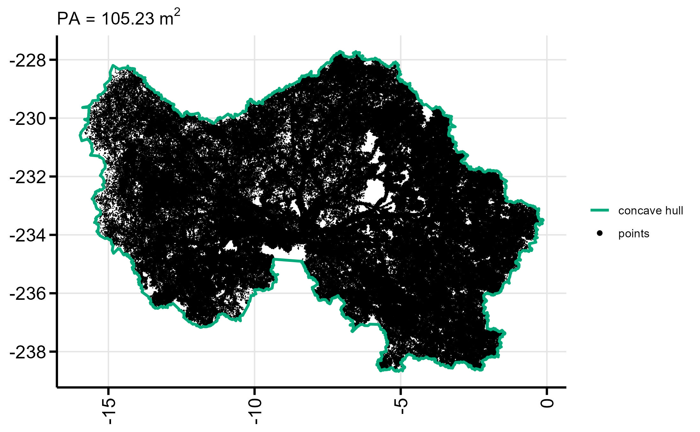
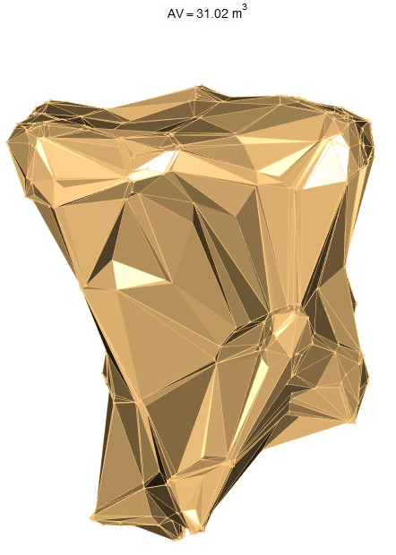

```{r, include = FALSE}
knitr::opts_chunk$set(
  collapse = TRUE,
  comment = "#>"
)
```


```{r eval = FALSE}
library(ITSMe)

```

## Goal

The goal of the ITSMe (Individual Tree Structural Metrics) R package is to 
provide easy to use functions to quickly obtain structural metrics from 
individual tree point clouds and their respective 
[TreeQSMs](https://github.com/InverseTampere/TreeQSM). 

## Point cloud based metrics

### Overview

An overview of the basic structural metrics which can be measured from an 
individual tree point cloud with the ITSMe package: 

| structural metric             | function name                     | 
| ------------------------------|:---------------------------------:|
| diameter at breast height (m) | `dbh_pc`                          |
| diameter above buttresses (m) | `dab_pc`                          | 
| tree height (m)               | `tree_height_pc`                  | 
| projected crown area (m$^{2}$)| `projected_crown_area_pc`         | 
| crown volume (m$^{3}$)        | `volume_crown_pc`                 | 

### Tree point cloud requirements

The tree point cloud based functions were developed for point clouds acquired 
with TLS. But they can also be used for tree point clouds obtained from other 
LiDAR platforms (e.g. MLS, UAV-LS) if their point densities are high enough 
(e.g. sufficient stem points for DBH measurement). 

Make sure outliers are removed. Down sampling of the point cloud is not required 
but can reduce computation time for very big tree point clouds.

### Workflow for a single tree

Before running the functions on multiple tree point clouds at a time, it is 
advised to get familiar with the functions by running them on a single tree 
point cloud. 

#### Read the point cloud

All of the point cloud based functions (mentioned above) need a tree point cloud 
in the form of a data.frame with columns X, Y, Z as their fist argument. The 
ITSME package provides a function `read_tree_pc`^[`read_tree_pc` can also take a 
second argument, *samplefactor*. This determines the amount of points that are 
sampled from the point cloud. 1 (default) to sample 100 percent of the points 
and for example 0.5 to sample 50 percent of the points. This is based on random 
sampling and is mainly useful to reduce the amount of points to reduce plotting 
time.] which takes the path to a tree point cloud file (txt, ply or las) as an 
argument and returns a data.frame with X, Y, Z columns.

```{r eval = FALSE}
# Read the point cloud file from its' specified path
tree_pc <- read_tree_pc(path = "path/to/point/cloud.txt")

```

#### Measure position of tree point cloud

The position of the tree can be easily determined using `tree_position_pc`, 
which determines the mean X and Y value of the tree point cloud at breast height 
(1.27 m - 1.33 m). 
```{r eval = FALSE}
# Measure tree position from the tree point cloud
XY_pos <- tree_position_pc(pc = tree_pc)

```

#### Measure tree height

The tree height can be measured using `tree_height_pc` as the difference between 
the Z-value of the highest and lowest point of the tree point cloud. 
`tree_height_pc` only needs the tree point cloud as an input.
```{r eval = FALSE}
# Measure tree height from the tree point cloud
H <- tree_height_pc(pc = tree_pc)

```
For tree point clouds that are obtained with airborne LiDAR (ALS, UAV-MLS) and 
that do not sample the base of the tree sufficiently it is not recommended to
use `tree_height_pc`. In those cases it is better to determine tree height using
a digital terrain model.

#### Measure DBH and/or DAB

Depending on if your trees are buttressed or not, you will make a choice between 
the diameter at breast height (DBH) and the diameter above buttresses (DAB). 

The DBH is measured using `dbh_pc`  as the diameter of the optimal circle fitted 
through a 6mm thick horizontal slice (from 1.27 m to 1.33 m above the lowest 
tree point). The `dbh_pc` function only needs the tree point cloud as an input, 
but if the second argument *plot* is set TRUE it also plots the circle fitting. 

```{r eval = FALSE}
# Measure DBH from the tree point cloud and plot the circle fitting
DBH <- dbh_pc(pc = tree_pc, plot = TRUE)

```


For some trees (mainly tropical, buttressed trees), `dbh_pc` could result in:


In this case determining the DAB with `dab_pc` is the better option. With 
`dab_pc`, the diameter (from the optimal circle fitted through a 6mm thick 
horizontal slice) is measured above the buttresses. The height at which the 
horizontal slice is taken (the height above buttresses), is determined 
iteratively, starting at breast height. The average residual between the points 
and the fitted circle is calculated. When the average residual exceeds a value 
of *thresholdbuttress* times the radius, indicating a non-circular (irregular) 
stem shape and presumably buttresses, and the *maxbuttressheight* is not 
exceeded, the process is repeated with a new slice 6 mm higher than the previous 
one. When the *maxbuttressheight* is exceeded the iterative process is restarted 
with a *thresholdbuttress* increased with 0.0005.

```{r eval = FALSE}
# Measure DAB from the tree point cloud with default settings and plot the circle fitting
DAB <- dab_pc(pc = tree_pc, plot = TRUE)

```


Optimise the values of *thresholdbuttress* and or *maxbuttressheight* for your 
tree if default values do not lead to the desired results:

 * reduce/increase *thresholdbuttress* if the height above buttresses is 
 consistenly too low/high.
 * reduce/increase *maxbuttressheight* if your buttresses reach lower/higher 
 heights.

The `dbh_pc` and `dab_pc` do not yet take into account (very) slanted trees. 
Therefore it is advised to always check the plots of the circle fitting. 

For tree point clouds that are obtained with airborne LiDAR (ALS, UAV-MLS) and 
that do not sample the stem of the tree sufficiently `dbh_pc` and `dab_pc` will 
not work due to a lack of stem points. 

#### Classify crown points 

As a basis for crown metrics (e.g. projected crown area and crown volume) the 
`classify_crown_pc` is be used to return the points from the tree point cloud 
that belong to the crown. The crown is defined here as all points of the tree 
except for the stem points below the first branch. The height where the first 
branch emerges is iteratively determined (starting from *minheight*) as the 
height where the diameter of the stem exceeds *thresholdbranch* multiplied with 
the DBH or DAB. 

```{r eval = FALSE}
# Classify the tree point cloud with default settings and plot the classification results
crown_pc <- classify_crown_pc(pc = tree_pc, plot = TRUE)

```


Optimise the values of *thresholdbranch* and or *minheight* for your 
tree if default values do not lead to the desired results:

 * reduce/increase *thresholdbranch* if the crown height is consistently 
 determined too high/low.
 * reduce *minheight* if the height at which the crown starts is 
 typically lower. 
 * increase *minheight* to the height above the widest part of the lower stem 
 (for example above the buttresses).

For buttressed trees, the attribute *buttress* has to be set TRUE and previously 
chosen attributes *thresholdbuttress* and *maxbuttressheight* can be specified.
It is recommended to increase the *minheight* for buttressed trees.

```{r eval = FALSE}
# Classify the tree point cloud of a buttressed tree and plot the classification results
crown_pc <- classify_crown_pc(pc = tree_pc, minheight = 4, buttress = TRUE, 
                              plot = TRUE)

```


#### Measure the projected crown area

The projected crown area (PCA) of a tree point cloud can be measured with 
`projected_crown_area_pc` which calculates the area of a concave hull (based on [concaveman](https://cran.r-project.org/web/packages/concaveman/index.html)) 
fitted to the crown points obtained with `classify_crown_pc`. As 
`projected_crown_area_pc` uses `classify_crown_pc`, it takes the same attributes. 
You can however, also specify *concavity* (default=2). 
```{r eval = FALSE}
# Measure the pca of a tree point cloud of a buttressed tree and plot the result
PCA <- projected_crown_area_pc(pc = tree_pc, minheight = 4, buttress = TRUE, 
                              plot = TRUE)

```


#### Measure the crown volume

The crown volume (CV) of tree point cloud can be measured with `volume_crown_pc` 
which calculates the volume of the 3D alpha-shape (based on [alphashape3d](https://cran.r-project.org/web/packages/alphashape3d/index.html)) 
fitted to the crown points obtained with `classify_crown_pc`. As 
`volume_crown_pc` uses `classify_crown_pc`, it takes the same attributes. 
You can however, also specify *alpha* (default=1). 
```{r eval = FALSE}
# Measure the crown volume of a tree point cloud of a buttressed tree and generate 3D plot
CV <- volume_crown_pc(pc = tree_pc, minheight = 4, buttress = TRUE, plot = TRUE)

```


### Workflow for multiple trees

#### Optimise and plot

Often you want to check or optimise the performance of the default attributes 
used in DBH, DAB, crown classification, PCA, and CV calculation, for multiple 
tree point clouds in one folder. For this purpose you can use 
`plot_dbh_fit_pcs` (based on `dbh_pc`), `plot_dab_fit_pcs` (based on `dab_pc`), 
`plot_crown_classification_pcs` (based on `classify_crown_pc`), `plot_pca_pcs` 
(based on `projected_crown_area_pc`), `plot_cv_pcs` (based on `volume_crown_pc`) 
which return the DBH, DAB, PCA and CV for each tree in a folder 
(*PCs_path*) and save the respective figures in the given output path  
(*OUT_path*). First run these functions with default parameters and check 
the rendered figures. Optionally change the attributes of the functions: 

  1. `plot_dab_fit_pcs`: *thresholdbuttress*, *maxbuttressheight*
  2. `classify_crown_pc`: *thresholdbranch*, *minheight* 
  3. `plot_pca_pcs` & `volume_crown_pc`: *concavity* & *alpha*

```{r eval = FALSE}
# Run plot_dbh_fit_pcs to see if buttresses influence dbh calculation and 
# dab calculation is necesarry
DBHs <- plot_dbh_fit_pcs(PCs_path = "path/to/point/clouds/folder/" , 
                         extension = ".ply", 
                         OUT_path = "path/to/output/folder/")
# For buttressed trees: 
# try out different values for thresholdbuttress and maxbuttressheight
DABs <- plot_dab_fit_pcs(PCs_path = "path/to/point/clouds/folder/" , 
                         extension = ".las", 
                         OUT_path = "path/to/output/folder/", 
                         thresholdbuttress = 0.002, maxbuttressheight = 9)
# Try out different values for thresholdbranch and minheight 
# For other attributes: use the values chosen in previous steps
# For non-buttressed trees: leave out buttress, thresholdbuttress and maxbuttressheight 
plot_crown_classification_pcs(PCs_path = "path/to/point/clouds/folder/" , 
                         extension = ".txt", 
                         OUT_path = "path/to/output/folder/", 
                         thresholdbranch = 2, minheight = 3, buttress = TRUE,
                         thresholdbuttress = 0.002, maxbuttressheight = 9)
# Try out a different value for concavity 
# For other attributes: use the values chosen in previous steps
PCAs <- plot_pca_pcs(PCs_path = "path/to/point/clouds/folder/" , 
                         extension = ".ply", 
                         OUT_path = "path/to/output/folder/", concavity = 3,
                         thresholdbranch = 2, minheight = 3, buttress = TRUE,
                         thresholdbuttress = 0.002, maxbuttressheight = 9)
# Try out a different value for alpha
# For other attributes: use the values chosen in previous steps
CVs <- plot_cv_pcs(PCs_path = "path/to/point/clouds/folder/" , 
                         extension = ".las", 
                         OUT_path = "path/to/output/folder/", alpha = 2,
                         thresholdbranch = 2, minheight = 3, buttress = TRUE,
                         thresholdbuttress = 0.002, maxbuttressheight = 9)

```

#### Summarise

Once you have decided on default/optimised attributes, you can summarise all 
point cloud structural metrics in one data.frame (and optionally export it to a 
csv file) for all tree point clouds in a folder with 
`summary_basic_pointcloud_metrics`. 

```{r eval = FALSE}
# Summary with default setting for non-buttressed trees
summary <- summary_basic_pointcloud_metrics(PCs_path = "path/to/point/clouds/folder/")
# Summary with default setting (except minheight and buttress) for buttressed trees 
summary <- summary_basic_pointcloud_metrics(PCs_path = "path/to/point/clouds/folder/", 
                                            minheight = 4, buttress = TRUE)
```

## QSM based metrics

### Overview

At the moment the ITSMe package contains 
[TreeQSM](https://github.com/InverseTampere/TreeQSM) based structural metrics 
defined by [Åkerblom et al. (2017)](https://doi.org/10.1016/j.rse.2016.12.002) 
and [Terryn et al. (2020)](https://doi.org/10.1016/j.isprsjprs.2020.08.009).

#### Structural metrics from Terryn et al. (2020)

These are the metrics defined in Terryn et al. (2020) which were copied and 
adapted from Åkerblom et al. (2017) except for the branch angle ratio and the 
relative volume ratio which were new metrics. Definitions of the metrics can be 
found in the help files of the functions and the papers of Terryn et al. (2020) 
and Åkerblom et al. (2017). Normalisation according to Terryn et al. (2020) as 
well as Åkerblom et al. (2017) is possible through the normalisation parameter 
included in the functions of the metrics that were adapted by Terryn et al. 
(2020). If the tree point cloud is provided along with the TreeQSM in the 
functions, DBH or DAB and tree height values are based on the point clouds 
rather than the QSMs. When the *buttress* parameter is indicated "TRUE" the DAB 
instead of the DBH is used.


| structural metric                         | function name                     | input                  |
| ------------------------------------------|:---------------------------------:|-----------------------:|
| stem branch angle (degrees)               | stem_branch_angle_qsm             | TreeQSM                |
| stem branch cluster size                  | stem_branch_cluster_size_qsm      | TreeQSM                |
| stem branch radius (-/m)                  | stem_branch_radius_qsm            | TreeQSM (+point cloud) |
| stem branch length (-/m)                  | stem_branch_length_qsm            | TreeQSM (+point cloud) |
| stem branch distance (-/m)                | stem_branch_distance_qsm          | TreeQSM (+point cloud) |
| dbh tree height ratio                     | dbh_height_ratio_qsm              | TreeQSM (+point cloud) |
| dbh tree volume ratio (m$^{-2}$)          | dbh_volume_ratio_qsm              | TreeQSM (+point cloud) |
| volume below 55                           | volume_below_55_qsm               | TreeQSM                |
| cylinder length volume ratio (m$^{-2}$)   | cylinder_length_volume_ratio_qsm  | TreeQSM                |
| shedding ratio                            | shedding_ratio_qsm                | TreeQSM                |
| branch angle ratio                        | branch_angle_ratio_qsm            | TreeQSM                |
| relative volume ratio                     | relative_volume_ratio_qsm         | TreeQSM                |
| crown start height                        | crown_start_height_qsm            | TreeQSM (+point cloud) |
| crown height                              | crown_height_qsm                  | TreeQSM (+point cloud) |
| crown evenness                            | crown_evenness_qsm                | TreeQSM                |
| crown diameter crown height ratio         | crown_diameterheight_ratio_qsm    | TreeQSM (+point cloud) |
| dbh minimum tree radius ratio             | dbh_minradius_ratio_qsm           | TreeQSM (+point cloud) |

### Workflow for a single tree

#### Read the TreeQSM

All of the TreeQSM based functions (mentioned above) need one or multiple 
components (e.g. cylinder, branch, treedata) of a TreeQSM in the form of lists 
as their fist arguments. The ITSME package provides a function `read_tree_qsm` 
which reads a TreeQSM matlab file (.mat) and returns its' components in a list 
(and optionally saves the TreeQSM components into the global environment when 
*global* = TRUE). It requires the *path* to the TreeQSM .mat file as a first 
argument and the TreeQSM *version* as a second (default = "2.4.0") argument.

```{r eval = FALSE}
# Read the TreeQSM file from its' specified path
qsm <- read_tree_qsm(path = "path/to/treeqsm.mat")
# Read the TreeQSM file of version "2.3.0" from its' specified path into the global environment
qsm <- read_tree_qsm(path = "path/to/treeqsm.mat", version = "2.3.0", 
                     global = TRUE)
```
#### Exract metrics Terryn et al. (2020)

After reading in the TreeQSM, the 17 different structural metrics listed in the 
table above can easily be calculated. Some of these structural metrics rely on 
only one of the TreeQSM components.

```{r eval = FALSE}
# Calculate the stem branch angle and branch angle ratio from the branch component
sba <- stem_branch_angle_qsm(branch = qsm$branch)
bar <- branch_angle_ratio_qsm(branch = qsm$branch)
# Calculate stem branch cluster size and crown evenness from the cylinder component 
sbcs <- stem_branch_cluster_size_qsm(cylinder = qsm$cylinder)
ce <- crown_evenness_qsm(cylinder = qsm$cylinder)
# Calculate the cylinder length volume ratio from the treedata component
clvr <- cylinder_length_volume_ratio_qsm(treedata = qsm$treedata)
```
Other metrics rely on two of the TreeQSM components.

```{r eval = FALSE}
# Calculate the volume below 55 and the relative volume ratio from 
# the cylinder and treedata component
vol_55 <- volume_below_55_qsm(cylinder = qsm$cylinder, treedata = qsm$treedata)
relvol_ratio <- relative_volume_ratio_qsm(cylinder = qsm$cylinder, 
                                          treedata = qsm$treedata)
# Calculate the shedding ratio from the branch and treedata component
shed_ratio <- shedding_ratio_qsm(branch = qsm$branch, treedata = qsm$treedata)
```

For some of the metrics which involve the DBH/DAB and/or the tree height, the 
tree point cloud of the tree can be provided as an input besides the TreeQSM 
data. This is because (in general) the DBH/DAB and tree height are more 
accurately measured from the complete tree point cloud. When the DBH is involved 
the DAB will be used if *buttress* = TRUE.

```{r eval = FALSE}
# Read the tree point cloud
tree_pc <- read_tree_pc(path = "path/to/point/cloud.txt")
# Calculate the dbh min tree radius and volume ratio using additional point cloud data
dmrr <- dbh_minradius_ratio_qsm(treedata = qsm$treedata, 
                                cylinder = qsm$cylinder, pc = tree_pc)
dvr <- dbh_volume_ratio_qsm(treedata = qsm$treedata, pc = tree_pc)
# Calculate the dbh height ratio of a buttressed tree using additional point cloud data
# Specify the optimised thresholdbuttress and maxbuttressheight when needed
dhr <- dbh_height_ratio_qsm(treedata = qsm$treedata, pc = tree_pc, 
                            buttress = TRUE, thresholdbuttress = 0.002, 
                            maxbuttressheight = 5)
# Calculate the crown start height, crown height and crown diameter height ratio
# using additional point cloud data
csh <- crown_start_height_qsm(treedata = qsm$treedata, cylinder = qsm$cylinder, 
                              pc = tree_pc)
ch <- crown_height_qsm(treedata = qsm$treedata, cylinder = qsm$cylinder, 
                         pc = tree_pc)
cdhr <- crown_diameterheight_ratio_qsm(treedata = qsm$treedata, 
                                            cylinder = qsm$cylinder, 
                                            pc =tree_pc)

```

Normalisation according to Terryn et al. (2020) as well as 
Åkerblom et al. (2017) is possible through the normalisation parameter 
included in the functions of the metrics that were adapted by Terryn et al. 
(2020).

```{r eval = FALSE}
# Calculate the stem branch radius according to Åkerblom et al. (2017)
sbr <- stem_branch_radius_qsm(cylinder = qsm$cylinder, treedata = qsm$treedata, 
                              normalisation = "parentcylinder")
# Calculate the stem branch length according to Terryn et al. (2020) 
sbl <- stem_branch_length_qsm(branch = qsm$branch, treedata = qsm$treedata, 
                              normalisation = "treeheight")
# Calculate the stem branch distance according to Åkerblom et al. (2017) and
# using point cloud information 
sbd <- stem_branch_distance_qsm(cylinder = qsm$cylinder, 
                                treedata = qsm$treedata, normalisation = "dbh", 
                                pc =  tree_pc, buttress = TRUE, 
                                thresholdbuttress = 0.002, 
                                maxbuttressheight = 5)
```
### Workflow for multiple trees

#### Summarise metrics Terryn et al. (2020)

you can summarise all structural metrics defined by Terryn et al. (2020) in one 
data.frame (and optionally export it to a csv file) for all TreeQSMs in a folder 
with `summary_Terryn_2020`. Choose the normalisation for 
`stem_branch_radius_qsm`, `stem_branch_length_qsm`, and 
`stem_branch_distance_qsm`. In case you want to use tree point cloud 
information, specify the folder (*PCs_path*) and *extension* of the tree point 
cloud files, indicate if the trees have buttresses (*buttress*) and specify if 
you want to use non-default argument values (*thresholdbuttress* and 
*maxbuttressheight*) to calculate the DAB (see chapter on point cloud metrics). 
If you want the data.frame to be exported to a csv file, specify the path to the 
output folder (*OUT_path*)

The QSM files have to be of the format xxx_000_qsm.mat (xxx is the plotname, 
000 is the tree number) or xxx_000_qsm_0.mat (0 at the end is for example the 
n-th QSM that is made for tree 000). When multiple QSMs are provided for one 
tree the mean and the standard deviation of the values of the different QSMs of 
one tree are also returned in additional data.frames. When provided, the tree 
point clouds files have to be of the format xxx_000_pc in order to link the tree 
point cloud to its' respective treeQSM.

```{r eval = FALSE}
# Run the summary function with default settings (without point cloud info)
summary_Terryn_2020(QSMs_path = "path/to/treeqsm/folder/")
# Run the summary function with default settings with point cloud info
summary_Terryn_2020(QSMs_path = "path/to/treeqsms/folder/", 
                    PCs_path = "path/to/point/clouds/folder/")
# Run the summary function with non-default settings with point cloud info
summary_Terryn_2020(QSMs_path = "path/to/treeqsms/folder/", version = "2.4.0", 
                    sbr_normalisation = "parentcylinder", 
                    sbl_normalisation = "dbh", sbd_normalisation = "dbh", 
                    PCs_path = "path/to/point/clouds/folder/", 
                    extension = ".ply", buttress = TRUE, 
                    thresholdbuttress = 0.002, maxbuttressheight = 5, 
                    OUT_path = "path/to/output/folder/")
```
